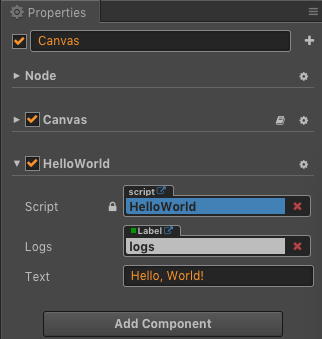
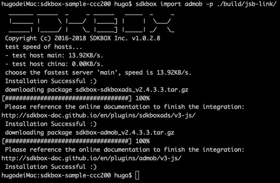

[&#171; SDKBOX Home](http://sdkbox.com)

# 在 Cocos Creator 工程上集成 SDKBox 插件
---

## Cocos Creator 工程准备

### 准备

* `SDKBox Installer` [安装](http://docs.sdkbox.com/en/installer/), 此文档使用 v1.0.2.8
* `CocosCreator` [安装](http://www.cocos.com/creator), 此文档使用 CocosCreator v2.0.0

### 介绍

本篇文档将结合 [SDKBox CocosCreator Admob Sample](https://github.com/sdkbox/sdkbox-sample-ccc200/tree/admob) , 介绍使用 SDKBox 将 Admob 集成到 CocosCreator 工程中. 并说明一些常见问题

### 创建一个 Cocos Creator 新的空白工程

创建一个空工程 `sdkbox-sample-ccc200` 

### 添加控件

在场景上添加两个按钮, UI界面可以如下图:


### 创建 JavaScript 的组件

创建一个 `HelloWorld.js` 的 javascript 组件. 在这个文件中, 主要是如下三个函数:

* initPluginAdMob 用来初始化 AdMob
* onButton1 用来响应 ShowInterstitial 按钮
* onButton2 用来响应 ShowBanner 按钮

```js
cc.Class({

    ...

    initPluginAdMob: function() {
        cc.log("init admob");
        //finish it after import admob, let it empty for now
    },

    onButton1: function() {
        cc.log("button1 clicked");
        //finish it after import admob, let it empty for now
    },

    onButton2: function() {
        cc.log("button2 clicked");
        //finish it after import admob, let it empty for now
    },

    ...

});
```

### 关联界面与 HellowWorld.js

将 HelloWorld.js 绑定到 Canvas, 绑定到哪个组件没有强制要求，能尽早初始化就好

将界面中的 button1 关联 HelloWorld.js 中的 onButton1 函数

将界面中的 button2 关联 HelloWorld.js 中的 onButton2 函数




### 在模拟器中运行

这一步主要是检查工程中的脚本，UI是否都正常, 点击 button 是否会有对应的 log 输出.

### 编译工程

打开 Cocos Creator 的编译窗口

菜单->工程->编译 或快捷键 (Command + Shift + B)


(请注意图中的 SDKBox 项未勾选, 以后续介绍中会提示这个选项)

依次点击
构建->编译
编译完成后，在 Creator 的 Console 中是应该是能看到 `Compile Successs` 类似的消息的 (如果失败了, 请检查对应 Creator 配置).

这一步主要是检查, CocosCreator 的空工程可以正常编译通过.

## 使用 SDKBox 插件

### 安装 SDKBox 插件

* 如果你使用的是 1.5 以上的 CocosCreator, 那么你可以直接使用, 因为 SDKBox 已内置到 Creator 中了.

* 如果你使用的是 1.5 以下的版本, 那么需要手动安装 SDKBox , 请在[这里](http://download.sdkbox.com/gui/creator/sdkbox-1.3.1.zip)下载 SDKBox for CocosCreator 插件, 将按[这里](https://docs.cocos.com/creator/manual/zh/extension/install-and-share.html)的介绍，安装到 Creator 的全局目录或项目目录下.

### 安装 AdMob 到 Cocos Creator 工程中

从这里开始, 我们会将 AdMob 安装到上面创建的 Creator 工程中(其它插件的集成流程雷同).

在 Creator 中安装 SDKBox 插件有两种方法, 一种是直接通过命令行的方式, 一种是通过GUI界面的方式

命令行方式:

* 打开命令行
* 运行命令 `cd sdkbox-sample-ccc200` 进入到工程根目录
* 运行命令 `sdkbox import admob -p ./build/jsb-link/` 把 admob 集成到 jsb-link 工程中

当然，如果你在构建时选择的工程类型是其它类型，那么工程名字应该是 jsb-xxx.

如果你要安装其它插件, 那就应该把 admob 替换为其它插件的名字.



GUI 方式:

SDKBox For Creator GUI 可以通过两种方式启动.

1. 在菜单中启动 SDKBox . (不同的版本, SDKBox 在菜单中的位置可能会有细微的差别)

2. 在 Creator 的构建工程面板中, 勾选中 SDKBox (还记得前几步中构建时提到的 SDKBox 选项吗), 构建完成, Creator 会询问你是否要启动 SDKBox.


安装 AdMob 插件


### 配置 AdMob

* 在 `./build/jsb-link/res/sdkbox_config.json` 中填入自己的 AdMob 广告id

可以参见[这里](
https://github.com/sdkbox/sdkbox-sample-ccc200/blob/admob/build/jsb-link/res/sdkbox_config.json) 来填写.

### 修改 HelloWorld.js

在 HellowWorld.js 加入对 Admob 插件的调用，实现初始化, cache, show 等逻辑.

对应的 API 文档可以在[这里](http://docs.sdkbox.com/zh/plugins/admob/v3-js/#api-reference)看.

在[这里](https://github.com/sdkbox/sdkbox-sample-ccc200/blob/admob/assets/Script/HelloWorld.js) 可以看 HelloWorld.js 的详细实现.

```js
cc.Class({

    ...

    initPluginAdMob: function() {
        if ('undefined' == typeof sdkbox) {
            this.log('sdkbox is undefined');
            return;
        }

        if ('undefined' == typeof sdkbox.PluginAdMob) {
            this.log('sdkbox.PluginAdMob is undefined');
            return;
        }

        const self = this;
        sdkbox.PluginAdMob.setListener({
            adViewDidReceiveAd: function(name) {
                self.log('adViewDidReceiveAd:'+name);
            },
            adViewDidFailToReceiveAdWithError: function(name, msg) {
                self.log('adViewDidFailToReceiveAdWithError:'+name+':'+msg);
            },
            adViewWillPresentScreen: function(name) {
                self.log('adViewWillPresentScreen:'+name);
            },
            adViewDidDismissScreen: function(name) {
                self.log('adViewDidDismissScreen:'+name);
            },
            adViewWillDismissScreen: function(name) {
                self.log('adViewWillDismissScreen:'+name);
            },
            adViewWillLeaveApplication: function(name) {
                self.log('adViewWillLeaveApplication:'+name);
            },
            reward: function(name, currency, amount) {
                self.log('reward:'+name+':'+currency+':'+amount);
            }
        });
        sdkbox.PluginAdMob.init();
    },

    onButton1: function() {
        const adName = 'interstitial'; //interstitial ad
        // const adName = 'reward'; //reward video
        if (sdkbox.PluginAdMob.isAvailable(adName)) {
            sdkbox.PluginAdMob.show(adName);
        } else {
            this.log(adName + ' is not available');
            sdkbox.PluginAdMob.cache(adName);
        }
    },

    onButton2: function() {
        const adName = 'banner';
        if (sdkbox.PluginAdMob.isAvailable(adName)) {
            sdkbox.PluginAdMob.show(adName);
        } else {
            this.log(adName + ' is not available');
            sdkbox.PluginAdMob.cache(adName);
        }
    },

    ...

});
```

### 再次构建编译 Creator 工程

* 菜单->工程->编译 或快捷键 (Command + Shift + B)
* 构建->编译
* 这里构建的目的就是让在 HelloWorld.js 中的修改都同步到 `./build/jsb-link` 工程中

### 用Xcode来编译运行

* 用Xcode打开 `./build/jsb-link/frameworks/runtime-src/proj.ios_mac/sdkbox-sample-ccc200.xcodeproj`
* 编译 运行

测试模式打开的状态下，一般都到取到广告, 如下是一种可能的 test ad, 并不唯一


## AdMob 常见问题

* sdkbox_config.json 中 AdMob 的 test, testdevice 区别

在内部其实还是使用 testdevice , test 这个算是一个设置 testdevice 的快捷方式. 所以一般要打开测试模式, 配置 test 为 true 就可以.

* 在正式模式下, 取不到广告, 一直返回 No Ad Filled

这时，首先要确保在测试模式下, 广告是可以显示出来的 (在测试模式下可以显示广告, 说明集成本身是没有问题的)

然后, 确保只是关闭了测试模式 , 就得到了 No Ad Filled 错误. 那应该是 AdMob 本身的填充率问题, 就是在当前, AdMob 没有广告可供展示.

