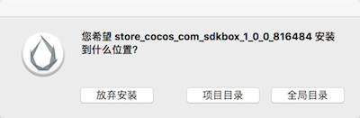
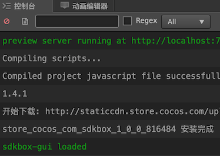
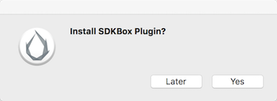

[&#171; SDKBOX Home](http://sdkbox.com)

<h1>在Cocos Creator上使用SDKBox For Creator</h1>

## 在 Cocos Creator 工程上使用 SDKBox For Creator 插件
---

### 介绍

`SDKBox For Creator`是一个运行在 Creator 上的 SDKBox GUI 插件, 它使用户可以图形化集成, 更新 SDKBox 插件.

### 当前环境

* `CocosCreator` Ver.2.4.1 [安装](http://www.cocos.com/creator)
* `SDKBox Installer` 1.4.0.0 [安装](http://docs.sdkbox.com/en/installer/)

<!-- 
### 安装 SDKBox For Creator

* 在 Creator 的菜单中 `插件` -> `插件商店` 打开商店
* 搜索 `sdkbox`


* 安装, 这里选择全局安装



* 笔者目前这个版本, Creator 并没有给出安装成功的提示, 只能从 console 中看 log



* 安装成功后, 如果没有在菜单中看到 SDKBox 项, 重启 Creator 试试


-->

### 通过脚本安装 SDKBox Installer

#### SDKBoxHelper

在这个[界面](https://github.com/hugohuang1111/sdkboxhelper/releases) 下载最新的 SDKBoxHelper.

Mac 平台, 请下载 `sdkboxhelper`

Windows 平台, 请下载 `sdkboxhelper.exe`

#### 安装 SDKBox Installer

在命令行中运行 `sdkboxhelper` , (Windwos平台就应该是运行 `sdkboxhelper.exe`) 如果你本机没有安装 SDKBox Installer, 会自动帮你安装.

#### 检查

安装完成后, 请新开一个命令行, 并输入 `sdkbox -h` , 检查是否安装成功. 如果报 sdkbox 不存在, 可能需要重启.

### 通过脚本安装 SDKBox For Creator

在 Cocos Creator 2.4.1+ 后, Cocos Creator 中不再内置 `SDKBox For Creator` .

可能通过以下命令在你的工程中安装 `SDKBox For Creator` .

`sdkboxhelper -t creator -p path/to/creator_project` , (Windwos平台请替换为 `sdkboxhelper.exe`)

### 在 Creator 上手动安装 SDKBox

上一步的命令安装和这里的手动安装是一样的流程. 只是上面的命令只会在工程中安装插件，目前不支持全局安装.

如果你使用的是 Creator 1.4.0- 或 Creator 2.4.1+ 版本, 那么你可能需要手动来集成 SDKBox.

* 通过这个[链接](http://sdkbox.anysdk.com/gui/creator/sdkbox-1.4.1.zip)下载 SDKBox For Creator 插件包
* 安装 SDKBox For Creator
    - 全局安装: 将上一步中的插件包解压到 `~/.CocosCreator/packages` (Windows 用户为 `C:\Users\${你的用户名}\.CocosCreator\packages`) 目录下
    - 项目安装: 将上一步中的插件包解压到 `${你的项目地址}/packages` 目录

* 如果扩展菜单中没有出现 `SDKBox` 项的话, 也许需要重启 Creator

* packages 目录结构应该类似以下:
```
packages
|--sdkbox
    |--app
    |--main.js
    |--package.json
```


### 使用 SDKBox For Creator

* 在菜单栏中 `SDKBox` -> `Launch`
* 如果你的工程还从来没有构建过，那么你会看到如下界面


* `SDKBox For Creator` 中的 Build 按钮, 或 Creator 菜单中 `项目` -> `构建发布` 都可以打开 Creator 的构建窗口

* 当你构建完成后, SDKBox 会主动提示你是否要安装 SDKBox 的插件, 这里点击是



* 然后在 `SDKBox For Creator` 中, 可以安装你所需要的插件了


# 插件 API

* 插件的 API 文档可以在[这里](http://docs.sdkbox.com/zh/)查看

这个[文档](http://docs.sdkbox.com/zh/qa/integration-admob-to-creator/)介绍了如何在 Creator 工程中代码上调用 AdMob 的样例.
