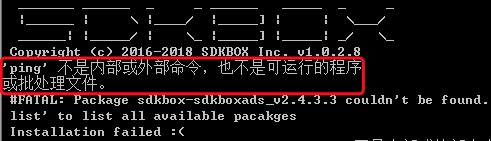

# 手动安装更新 SDKBox

如果你遇到以下几种情况:

* 安装 SDKBox Installer
* 手动更新 SDKBox GUI
* 在 SDKBox GUI 的加载界面被卡住
* SDKBox GUI 显示白屏

可以尝试以下步骤, 依次检查, 验证

## Python 安装

SDKBox 是基于 Python 2.7, 请确保你本机已安装 Python 2.7, 并且在命令行中运行 `python --version` , 可以返回 `Python 2.7.10` 类似的字符.


```bash
$ python --version
Python 2.7.10
```


## 安装 Installer

在你的终端中运行以下命令:

```bash
python -c """import urllib; s = urllib.urlopen('https://raw.githubusercontent.com/sdkbox-doc/en/master/install/install.py').read(); exec(s)"""
```

如果 SDKBox Installer 未安装, 此脚本会将 SDKBox 安装到你的电脑.

如果 SDKBox Installer 已安装, 此脚本会返回 `SDKBox installer have been installed`

如果运行以上脚本, 直接结束，没有任何返回, 那你需要根据脚本中的 url , 将 install.py 下载到你本机, 然后在命令行中运行 `python install.py`

安装完成后, 请重新打开终端(有些情况下, 可能还需要重启电脑), 运行 `sdkbox` 命令, 应该可以看到 SDKBOX 相关的信息.

## 安装 SDKBox GUI For Creator

目前 Creator 中已自带了 SDKBox, 不需要用户手动安装.

## 更新 SDKBox GUI For Creator

在你的终端中运行以下命令:

```bash
python -c """import urllib; s = urllib.urlopen('https://raw.githubusercontent.com/sdkbox-doc/en/master/install/updateguiforcreator.py').read(); exec(s)"""
```

更新完成后, 会在终端中显示更新完成的信息.

如果运行以上脚本, 直接结束，没有任何返回, 那你需要根据脚本中的 url , 将 updateguiforcreator.py 下载到你本机, 然后在命令行中运行 `python updateguiforcreator.py`

这时重新打开 Creator , 启动 SDKBox GUI, 应该可以顺利完成加载.

## 安装插件问题

* 在安装插件时, 如果遇到 `ping` 找不到的错误(一般发生在 Windows 系统中), 如下:




需要将 `C:\windows\system32\` 加到环境变量 `path` 中, 修改后，请在命令行中运行 ping , 验证修改结果.

## 联系我们

如果有问题反馈给我们, 可以加 SDKBox QQ群(489182678), 论坛: https://discuss.cocos2d-x.org/


